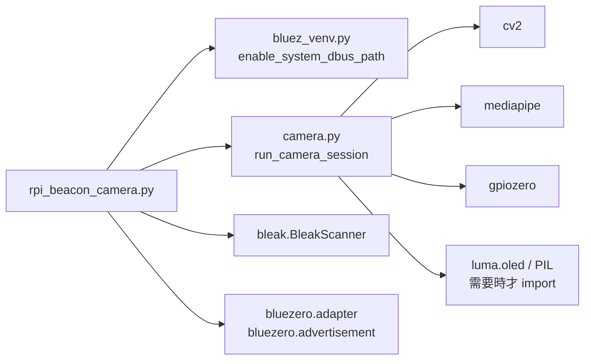
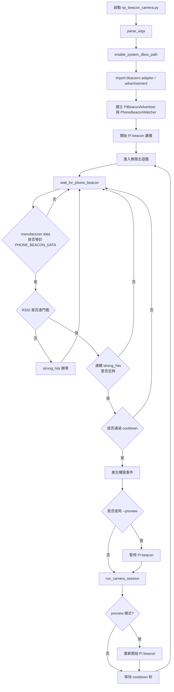
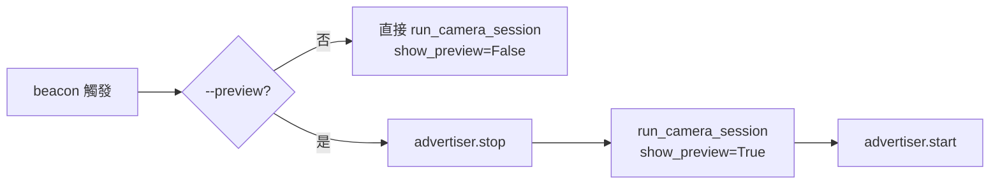
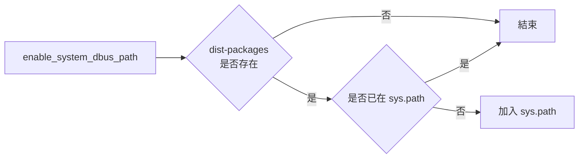
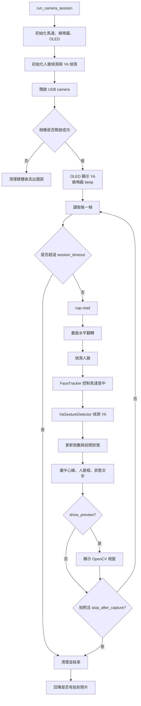
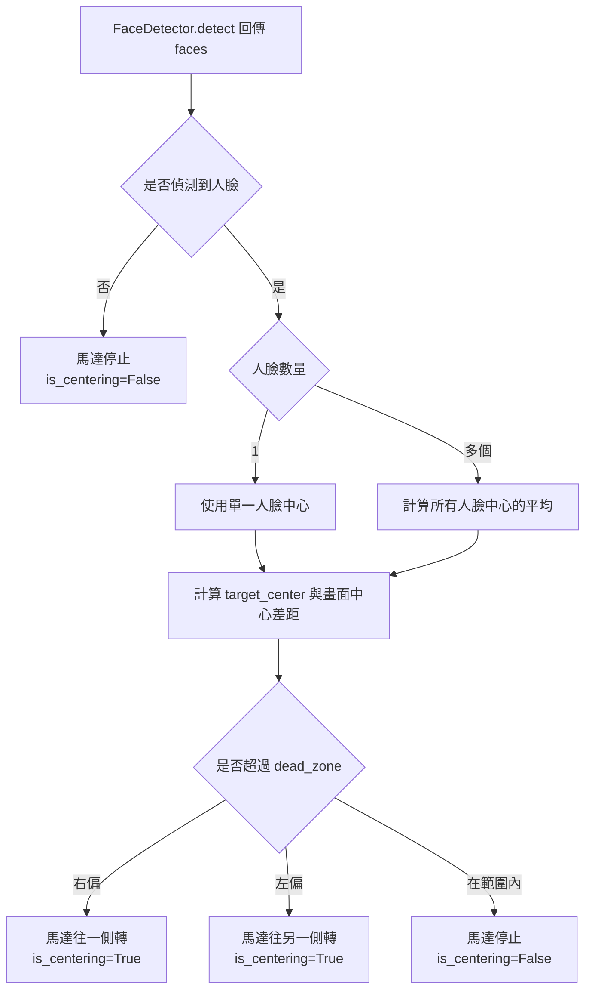
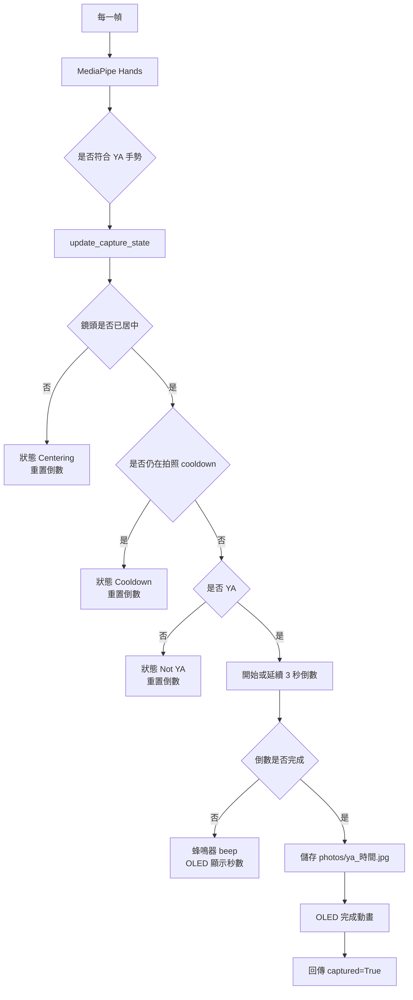
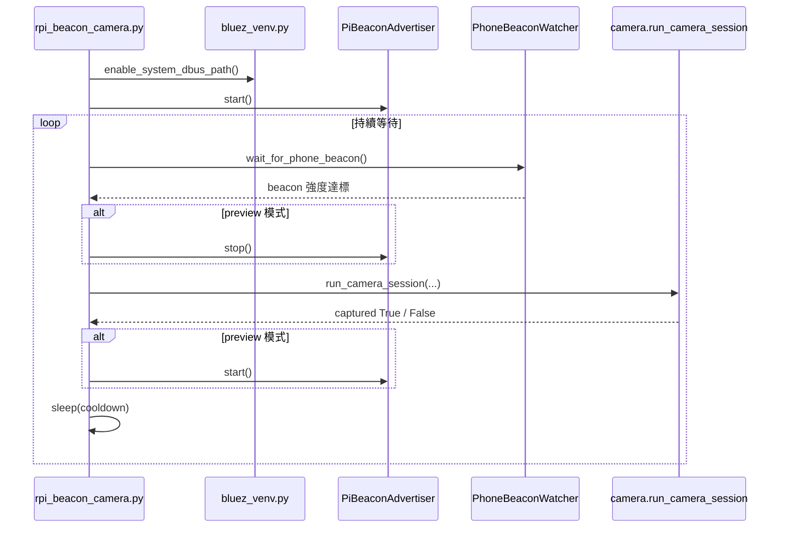

# `rpi_beacon_camera.py` 相關程式結構

這份文件只整理 `rpi_beacon_camera.py` 執行時會用到的 Python 程式與流程。`le_advertiser.py`、`le_scanner.py` 是獨立測試工具，沒有被 `rpi_beacon_camera.py` import，因此不納入主流程說明。

## 會用到的本地檔案

| 檔案 | 被誰使用 | 功能 |
|---|---|---|
| `rpi_beacon_camera.py` | 主入口 | 啟動 Pi BLE 廣播、掃描指定手機 beacon、達到 RSSI 條件後啟動相機 |
| `bluez_venv.py` | `rpi_beacon_camera.py` | 補上系統 Python 套件路徑，讓 virtualenv 可以找到 `dbus` / `gi` |
| `camera.py` | `rpi_beacon_camera.py` | 提供 `run_camera_session()`，負責相機、人臉追蹤、YA 手勢、倒數與拍照 |

## Import 關係



## `rpi_beacon_camera.py`

### 主要責任

`rpi_beacon_camera.py` 是 Raspberry Pi 端的整合主程式。它同時做兩件事：

1. 用 `PiBeaconAdvertiser` 發送 Pi 自己的 BLE beacon。
2. 用 `PhoneBeaconWatcher` 掃描外部裝置送出的指定 beacon，當訊號夠強且連續命中後，呼叫 `camera.run_camera_session()`。

### 主要設定

| 常數 | 預設值 | 說明 |
|---|---:|---|
| `PI_LOCAL_NAME` | `RPi_112360104` | Pi beacon 的 local name |
| `MANUFACTURER_ID` | `0xFFFF` | manufacturer data ID |
| `PI_BEACON_DATA` | `00 11 00 44` | Pi 廣播出去的資料 |
| `PHONE_BEACON_DATA` | `00 11 00 44` | 掃描時要比對的 beacon 資料 |
| `RSSI_TRIGGER_DBM` | `-60` | RSSI 達到此門檻才算靠近 |
| `REQUIRED_STRONG_HITS` | `3` | 需要連續幾次強訊號才觸發 |
| `CAMERA_COOLDOWN_SECONDS` | `3` | 相機 session 結束後冷卻秒數 |
| `CAMERA_SESSION_TIMEOUT_SECONDS` | `15` | 單次相機 session 最長秒數 |

### 類別與函式

| 名稱 | 功能 |
|---|---|
| `PiBeaconAdvertiser.start()` | 找到藍牙 adapter、開啟電源、建立 BLE advertisement、註冊並開始廣播 |
| `PiBeaconAdvertiser.stop()` | 取消註冊 advertisement，停止廣播 thread |
| `PhoneBeaconWatcher.handle_detection()` | 每次掃到 BLE 廣播時執行，負責比對 manufacturer data、RSSI、連續命中次數與 cooldown |
| `wait_for_phone_beacon(watcher)` | 啟動 `BleakScanner`，等待 watcher queue 收到有效觸發事件 |
| `parse_args()` | 解析 `--preview`、`--rssi`、`--strong-hits`、`--cooldown`、`--camera-timeout` |
| `main(args)` | 主迴圈：廣播、等待 beacon、啟動相機、冷卻後繼續等待 |

## 主程式流程



## Preview 模式差異

`--preview` 會開 OpenCV 視窗。程式在 preview 模式下會先停止 Pi beacon，再進入相機 session；相機結束後再重新開始廣播。



## `bluez_venv.py`

`rpi_beacon_camera.py` 在 import `bluezero` 前會先呼叫：

```python
enable_system_dbus_path()
```

它會把 `/usr/lib/python3/dist-packages` 加入 `sys.path`。原因是 Raspberry Pi OS 的 `python3-dbus`、`python3-gi` 常透過 apt 安裝在系統 Python 路徑，而 virtualenv 可能找不到這些套件。

流程很短：



## `camera.py`

`rpi_beacon_camera.py` 只直接使用 `camera.py` 的一個函式：

```python
run_camera_session(
    stop_after_capture=True,
    session_timeout=args.camera_timeout,
    show_preview=args.preview,
)
```

不過 `run_camera_session()` 內部會建立多個物件來完成相機任務。

### `run_camera_session()` 會用到的類別

| 類別 | 在 session 中的功能 |
|---|---|
| `StepperMotor` | 控制馬達左右旋轉，讓人臉中心靠近畫面中心 |
| `Buzzer` | YA 倒數時 beep，session 開始時也會 beep 一次 |
| `OledDisplay` | 顯示 `YA`、倒數秒數與完成動畫；初始化失敗時會自動停用 |
| `FaceDetector` | 使用 Haar cascade 偵測人臉 |
| `FaceTracker` | 根據單人或多人臉部中心，決定馬達是否要轉動 |
| `YaGestureDetector` | 用 MediaPipe Hands 判斷 YA 手勢、控制倒數與拍照 |

### 相機 session 流程



### 人臉追蹤流程



### YA 拍照流程



## 從主程式到拍照完成的完整路徑



## 執行方式

無預覽視窗：

```bash
python rpi_beacon_camera.py
```

有預覽視窗：

```bash
python rpi_beacon_camera.py --preview
```

常用參數：

```bash
python rpi_beacon_camera.py --rssi -55 --strong-hits 3 --cooldown 3 --camera-timeout 15
```

## 不在本文件範圍內的檔案

| 檔案 | 原因 |
|---|---|
| `le_advertiser.py` | 沒有被 `rpi_beacon_camera.py` import，只是獨立 BLE 廣播測試工具 |
| `le_scanner.py` | 沒有被 `rpi_beacon_camera.py` import，只是獨立 BLE 掃描測試工具 |
